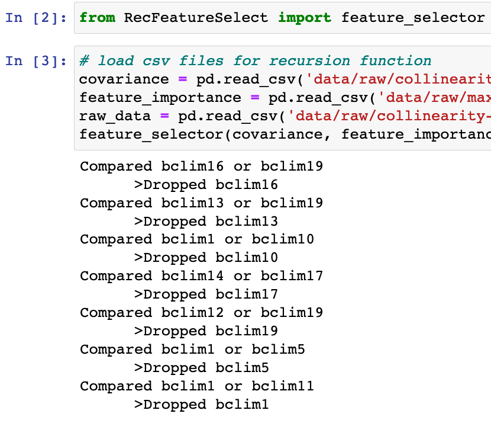

## RecFeatureSelect (Recursive Feature Selection). 

---

Feature selection via recursive removal of the most correlated pair. The feature importance scores are used as the rankings, deciding which variable to drop at each call.

Runtime output | Final covariance (r < 0.85)
:---------------------------------:|:----------------------------------------:
 | 

---

`pip import RecFeatureSelect`   `from RecFeatureSelect import feature_selector`

* The main function can be found from the source folder, RecFeatureSelect.
* The input data consists of the original covariance matrix, the feature importance scores, a spearman correlation threshold, and the raw data. 
* After the run the function will save the final covariance matrix to file as "cov.csv". All correlations will be less than the input threshold.  

---

* [RecFeatureSelect](https://github.com/daniel-furman/RecFeatureSelect/tree/main/src/RecFeatureSelect) - the library code itself
* [docs](https://github.com/daniel-furman/RecFeatureSelect/tree/main/docs) - instructions for import and basic use
* [LICENSE](https://github.com/daniel-furman/RecFeatureSelect/blob/main/LICENSE) - the MIT license, which applies to this package
* README.md - the README file, which you are now reading
* [requirements.txt](https://github.com/daniel-furman/RecFeatureSelect/blob/main/requirements.txt) - prerequisites to install this package, used by pip
* [setup.py](https://github.com/daniel-furman/RecFeatureSelect/blob/main/setup.py) - installer script
* [tests](https://github.com/daniel-furman/RecFeatureSelect/tree/main/test)/ - unit tests

### Longer Description:

---

This function selects de-correlated features for a modeling experiment by filtering the most similar pair at each call. The algorithm reaches the
stopping case when all pairs of features are below the Spearman's statistic `threshold`. The feature importances are used as the ranking.

